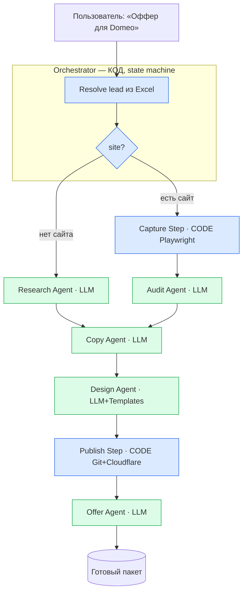
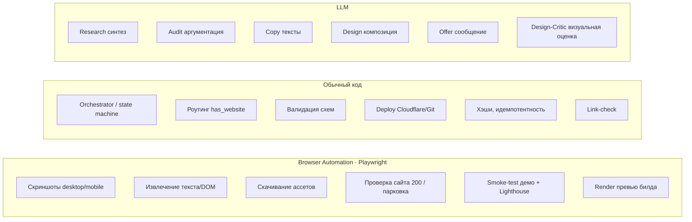
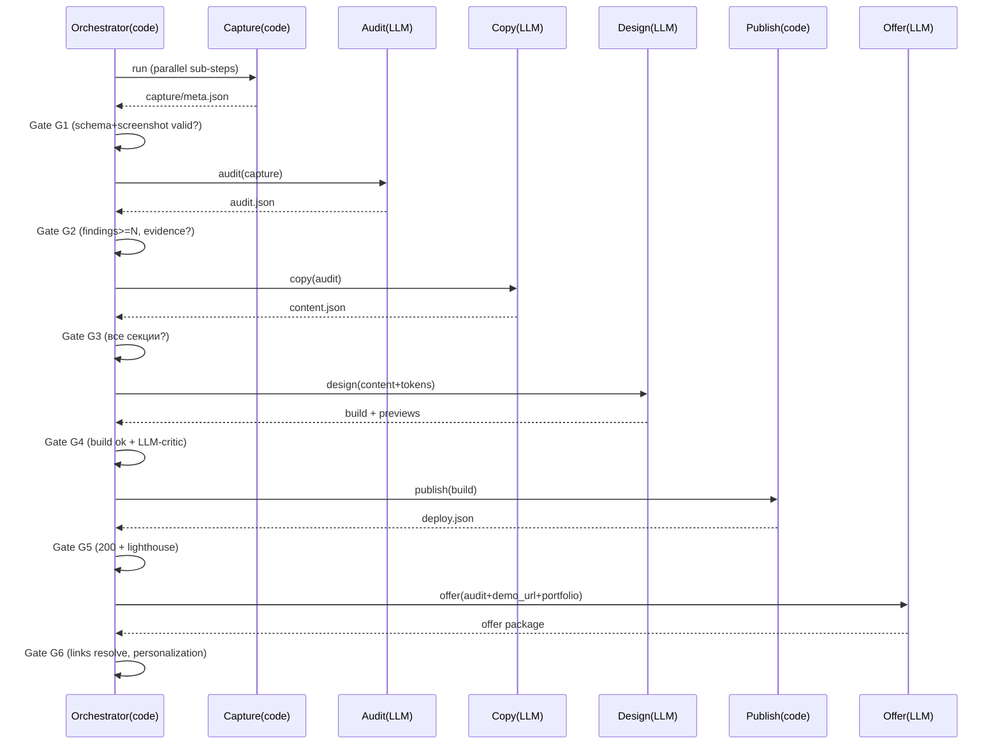

# Architecture Decision Record: LeadGen Multi‑Agent System

*Статус: Proposed · Автор: Solution Architect · Область: Cursor Agents + Orchestration*

Рабочая директория пустая — проектируем greenfield, ограничений от легаси нет. Ниже — финальная архитектура, а не пересказ твоего наброска. Где я меняю твою схему, объясняю почему и какой компромисс.

---

## 0. TL;DR — ключевые решения

| # | Решение | Почему |
|---|---------|--------|
| 1 | **Blackboard-архитектура: файловая система = шина сообщений.** Агенты не общаются напрямую, только через JSON-артефакты на диске. | Даёт минимальный контекст, заменяемость, повторный запуск любого этапа, детерминизм. |
| 2 | **Orchestrator — это код (Node/TS или Python), а не LLM.** Конечный автомат (state machine) над файлами состояния. | Детерминизм, дешевизна, тестируемость, отсутствие «галлюцинаций маршрутизации». |
| 3 | **Screenshot и Publish — НЕ агенты, а детерминированные шаги (Playwright / Git+Cloudflare).** | Здесь нет рассуждений. LLM тут — трата токенов и источник ошибок. |
| 4 | **Design Agent не «пишет сайт с нуля», а собирает его из design-system + vertical-шаблонов.** | Радикально повышает повторяемость и качество, снижает токены. Компромисс — меньше уникальности (решается набором архетипов). |
| 5 | **Реальные ассеты клиента (логотип, фото, факты) переиспользуются в демо.** | Владелец видит СВОЙ бизнес, а не абстрактный шаблон → конверсия в продажу выше. |
| 6 | **5 LLM-агентов**: Research (условный), Audit, Copy, Design, Offer. Остальное — код. | «Один агент = одна ответственность» + минимизация LLM-этапов. |
| 7 | **Каждый переход через Quality Gate**: сначала детерминированная валидация (schema + технические проверки), затем — только где нужно — LLM-критик. | Надёжность без лишних токенов. |

---

## 1. Контекст и цель

Вход: лид уже собран скрапером (`name`, `site?`, прочие поля). Выход: пакет для отправки клиенту — **аргументированный анализ**, **демо нового сайта**, **персональное УТП со ссылками**.

Две ветки процесса:
- **Сайт есть** → аудит существующего → персонализация на его основе.
- **Сайта нет** → research компании → персонализация на основе research.

Триггер: пользователь пишет `«Подготовь оффер для Domeo»`. Оркестратор находит лид в Excel/данных, запускает пайплайн.

---

## 2. Принципы (как они применены)

| Принцип | Как реализован в архитектуре |
|---------|------------------------------|
| Один агент = одна ответственность | Каждый агент читает 1–2 входных контракта, пишет 1 выходной. |
| Минимальный контекст | Агент получает только свои input-файлы, а не историю пайплайна. |
| Детерминизм | Оркестратор и все не-рассуждающие шаги — код. LLM только там, где нужен язык/суждение. |
| Заменяемость | Агент = чёрный ящик над JSON-контрактом. Меняешь реализацию, контракт стабилен. |
| Повторный запуск этапа | Состояние в `state.json`; можно запустить `--stage audit` для одного лида. |
| Масштабирование | Лиды независимы → горизонтальный параллелизм по лидам. |
| Минимизация стоимости/токенов | Шаблоны вместо генерации с нуля; код вместо LLM; передача ссылок/фактов, а не сырого HTML. |
| Повторяемость | Фиксированные схемы, температура низкая, шаблоны, snapshot-тесты контрактов. |
| Тестируемость | Каждый агент тестируется на фиксированном input-JSON → сравнение output по схеме. |

---

## 3. High-level архитектура (Blackboard + Orchestrator)



Синие узлы — детерминированный код. Зелёные — LLM-агенты. **Ни один агент не вызывает другого напрямую** — оркестратор читает выход одного и подаёт вход следующему.

---

## 4. Логика ветвления

Решение принимает **оркестратор (код)**, а не LLM — это детерминированная проверка поля:

```
has_website = bool(lead.site) AND site_reachable(lead.site)  # HTTP 200 + не парковка домена
```

- `has_website == true`  → `Capture → Audit → Copy → Design → Publish → Offer`
- `has_website == false` → `Research → Copy → Design → Publish → Offer`

Важно: даже при отсутствии сайта Copy/Design/Offer работают одинаково — они читают либо `audit.json`, либо `research.json` как «источник персонализации» (единый абстрактный контракт `personalization_source`).

---

## 5. Ростер агентов: нужные / лишние / разделить / объединить

### 5.1 Ответы на вопросы 1–4

**Q1 — Какие агенты реально нужны (LLM):**

| Агент | Ответственность | Почему LLM |
|-------|-----------------|-----------|
| **Research** (условный) | Собрать факты о компании, если нет сайта: ниша, услуги, гео, конкуренты, боли клиентов. | Синтез разрозненной инфы из веб-поиска. |
| **Audit** | Человеческим языком доказать, почему сайт теряет деньги. | Суждение, аргументация, язык. |
| **Copy** | Новые тексты для демо (заголовки, офферы, CTA, блоки). | Копирайтинг. |
| **Design** | Собрать сайт из design-system + vertical-шаблона, разложить копирайт по слотам, подобрать композицию. | Дизайн-решения, адаптация под нишу. |
| **Offer** | Персональное сообщение + УТП + сборка ссылок. | Персонализированный текст продажи. |

**Q2 — Лишние агенты (убрать из списка агентов):**

| Из твоего наброска | Вердикт | Куда переносим |
|--------------------|---------|----------------|
| **Screenshot Agent** | ❌ Не агент | Детерминированный **Capture Step** (Playwright). Нет рассуждений → нет LLM. |
| **GitHub Publish Agent** | ❌ Не агент | Детерминированный **Publish Step** (git + Cloudflare Pages API). |
| **«Сбор данных» как отдельный агент** | ❌ Лишний | Часть Capture (для сайта) или Research (без сайта). Отдельная сущность плодит контракты без пользы. |

**Q3 — Что разделить:**

- **Copy ≠ Design.** Разные ответственности (текст vs композиция/код). Раздельно → можно перегенерировать дизайн, не трогая тексты, и наоборот. Тестируются независимо.
- **Audit ≠ Copy.** Аудит доказывает проблему; Copy предлагает решение. Copy читает `audit.json`, но это разные суждения и разные Quality Gates.
- **Внутри Capture**: скриншоты (desktop/mobile), DOM/текст, ассеты (логотип, фото) — параллельные подшаги.

**Q4 — Что объединить:**

- **Скриншоты + извлечение DOM + скачивание ассетов** → один шаг **Capture** (общий контекст страницы, один заход Playwright, экономия запусков браузера).
- **Publish + smoke-test демо** → один шаг **Publish** (деплой и проверка 200 неразделимы логически).
- **Offer + сборка ссылок (demo URL, portfolio, прайс)** → один агент Offer (сообщение и его ссылки — единый артефакт).

### 5.2 Итоговый ростер

```
CODE   : Orchestrator, Capture, Publish, все Quality Gates (валидация)
LLM    : Research(условно), Audit, Copy, Design, Offer
LLM-QA : Design-Critic (мини-агент только на финальном визуальном гейте)
```

---

## 6. Orchestrator (Q5)

**Что это:** headless-скрипт на TS/Python (рекомендую **Cursor CLI/SDK** для запуска агентов в headless-режиме), реализующий конечный автомат над `state.json`.

**Обязанности (и только они):**
1. Резолв лида (`«Domeo»` → строка Excel / прямые данные из запроса).
2. Инициализация рабочей папки лида и `state.json`.
3. Маршрутизация по ветке (`has_website`).
4. Последовательный/параллельный запуск шагов согласно графу зависимостей.
5. Прогон Quality Gate между шагами; при провале — retry (N раз) или остановка с диагностикой.
6. Идемпотентность: если артефакт этапа валиден и вход не изменился (хэш инпутов) — этап пропускается.
7. Логирование, стоимость (токены/этап), финальная сборка пакета.

**Чего оркестратор НЕ делает:** не рассуждает, не пишет контент, не принимает «творческих» решений. Вся логика — детерминированные if/switch и валидаторы схем.

**Состояние (`state.json`) — сердце системы:**

```jsonc
{
  "lead_id": "domeo",
  "branch": "has_website",
  "stages": {
    "capture":  { "status": "done",    "hash": "a1b2", "artifact": "capture/meta.json", "cost": 0 },
    "audit":    { "status": "done",    "hash": "c3d4", "artifact": "audit.json", "cost": 0.012 },
    "copy":     { "status": "running", "attempts": 1 },
    "design":   { "status": "pending" },
    "publish":  { "status": "pending" },
    "offer":    { "status": "pending" }
  },
  "updated_at": "..."
}
```

Это даёт **повторный запуск любого этапа** (`--stage design --lead domeo`) и **resume после сбоя**.

---

## 7. Поток данных и JSON-контракты (Q6, Q7)

### 7.1 Что передаётся между агентами (Q6) — принцип «минимальный контекст»

Агенты **не** передают друг другу сырой HTML или историю. Передаются **дистиллированные структуры**:

| Переход | Передаётся | НЕ передаётся |
|---------|-----------|---------------|
| Capture → Audit | скриншоты (пути), извлечённый текст, метрики (LCP, mobile-friendly, наличие CTA/форм) | сырой минифицированный HTML целиком |
| Audit/Research → Copy | список проблем + факты о бизнесе + tone | скриншоты |
| Copy → Design | `content.json` (слоты текста) + brand tokens | аудит-аргументы |
| Design → Publish | путь к собранному билду | — |
| Publish → Offer | demo_url, статусы проверок | билд |
| * → Offer | audit-highlights + demo_url + portfolio + прайс | всё сырьё |

### 7.2 JSON-контракты (Q7)

Все контракты — версионированы (`schema_version`), валидируются JSON Schema в Quality Gate. Ключевые:

**`lead.json`** (вход):
```jsonc
{ "schema_version": "1.0", "lead_id": "domeo", "name": "Domeo",
  "site": "https://domeo.ru", "phone": "...", "category": "ремонт квартир",
  "geo": "Москва", "source": "yandex_maps", "raw": { } }
```

**`capture/meta.json`**:
```jsonc
{ "schema_version": "1.0", "url": "...", "http_status": 200,
  "screenshots": { "desktop": "capture/desktop.png", "mobile": "capture/mobile.png" },
  "extracted_text": "capture/text.txt",
  "assets": { "logo": "capture/logo.png", "photos": ["..."] },
  "signals": { "lcp_ms": 4200, "mobile_friendly": false, "has_cta": false,
               "has_form": true, "https": true, "tech": "wix|tilda|custom" } }
```

**`audit.json`** (или `research.json` — оба реализуют `personalization_source`):
```jsonc
{ "schema_version": "1.0", "lead_id": "domeo",
  "business_facts": { "services": [...], "usp_existing": [...], "audience": "..." },
  "findings": [
    { "id": "trust-01", "category": "доверие",
      "claim": "Нет реальных фото объектов и отзывов",
      "evidence": "capture/desktop.png#section-2",
      "impact": "клиент не верит в качество → уходит к конкуренту с портфолио",
      "severity": "high" }
  ],
  "money_loss_summary": "человеческим языком, аргументированно",
  "tone": "деловой, уверенный, без воды" }
```

**`content.json`** (выход Copy → вход Design):
```jsonc
{ "schema_version": "1.0", "vertical": "renovation",
  "sections": {
    "hero": { "headline": "...", "subheadline": "...", "cta": "..." },
    "benefits": [ { "title": "...", "text": "..." } ],
    "social_proof": { "reviews": [...], "cases": [...] },
    "contact": { "phone": "...", "cta": "..." }
  },
  "reuse_facts": ["настоящие услуги/цены из capture"] }
```

**`design/build.json`**:
```jsonc
{ "schema_version": "1.0", "template": "renovation-v2",
  "brand_tokens": { "primary": "#...", "font": "...", "logo": "capture/logo.png" },
  "build_dir": "design/dist", "screens": ["design/preview-desktop.png", "design/preview-mobile.png"] }
```

**`deploy.json`**:
```jsonc
{ "schema_version": "1.0", "demo_url": "https://domeo-demo.pages.dev",
  "checks": { "http_200": true, "lighthouse_perf": 96, "no_console_errors": true } }
```

**`offer.json` + `offer.md`** (финал):
```jsonc
{ "schema_version": "1.0",
  "message": "готовый к отправке текст",
  "usp": ["..."], "why_this_company": "...",
  "links": { "demo": "...", "portfolio": "...", "audit_pdf": "..." } }
```

---

## 8. Дерево каталогов и артефакты (Q20)

**Структура репозитория:**
```
LeadGenerator/
├─ src/                     # КОД pipeline (TypeScript strict, tsx)
│  ├─ orchestrator/         # state machine, CLI, routing
│  │  ├─ index.ts           # CLI entry (--lead, --data, --stage, --force)
│  │  ├─ pipeline.ts
│  │  ├─ state.ts
│  │  ├─ resolveLead.ts
│  │  └─ routing.ts         # decideBranch + probeSite only (код, без LLM)
│  ├─ gates/                # валидаторы схем + технические проверки (G1–G6)
│  │  ├─ validate.ts
│  │  └─ g1Capture.ts …
│  ├─ steps/                # КОД-шаги (не LLM)
│  │  ├─ capture/           # Playwright
│  │  └─ publish/           # Cloudflare Pages
│  └─ lib/                  # paths, log, types, shared helpers
├─ agents/                  # pipeline LLM-агенты (промпт + скоуп; не .cursor/agents/)
│  ├─ research/
│  ├─ audit/
│  ├─ copy/
│  ├─ design/
│  ├─ design-critic/
│  └─ offer/
├─ .cursor/
│  ├─ rules/                # глобальные + scoped rules
│  ├─ skills/               # переиспользуемые процедуры (см. §10)
│  └─ agents/               # subagents Cursor для разработки репозитория
├─ context/                 # см. §11
│  ├─ positioning.md
│  ├─ portfolio.json
│  ├─ design-system/
│  ├─ verticals/            # шаблоны по нишам
│  ├─ audit-framework.md
│  └─ tone-of-voice.md
├─ schemas/                 # JSON Schema всех контрактов
├─ leads.xlsx               # источник лидов
└─ leads/                   # РАБОЧИЕ ДАННЫЕ (артефакты blackboard)
   └─ domeo/
      ├─ state.json
      ├─ lead.json
      ├─ capture/  (desktop.png, mobile.png, text.txt, logo.png, meta.json)
      ├─ research.json         # только для ветки без сайта
      ├─ audit.json
      ├─ content.json
      ├─ design/   (dist/, preview-*.png, build.json)
      ├─ deploy.json
      └─ offer/    (offer.md, offer.json, audit.pdf)
```

**Артефакты, сохраняемые после каждого этапа (Q20):**

| Этап | Артефакт | Назначение |
|------|----------|-----------|
| Resolve | `lead.json`, `state.json` | вход + состояние |
| Capture | `capture/*` (скрины, текст, ассеты, meta) | доказательная база аудита + переиспользование |
| Research | `research.json` | персонализация без сайта |
| Audit | `audit.json` (+ `audit.pdf` для клиента) | аргументированный анализ |
| Copy | `content.json` | тексты нового сайта |
| Design | `design/dist/`, `preview-*.png`, `build.json` | демо-билд + превью для критика |
| Publish | `deploy.json` | ссылка на демо + результаты проверок |
| Offer | `offer.md`, `offer.json` | готовый пакет |

Каждый артефакт самодостаточен и версионирован → полная воспроизводимость и аудитируемость.

---

## 9. Rules: глобальные и агентские (Q8, Q11, Q12)

### 9.1 Глобальные rules — общие для ВСЕХ агентов (Q8, Q11)

| Rule | Суть |
|------|------|
| `output-language` | Все клиентские тексты — на русском, деловой тон. |
| `contract-first` | Агент ОБЯЗАН выдать валидный по схеме JSON; ничего кроме контракта. |
| `evidence-only` | Запрещено выдумывать факты/метрики. Каждое утверждение ссылается на артефакт (скрин/текст/research). |
| `no-fabricated-numbers` | Нельзя придумывать «сайт теряет 40% клиентов» без основания — только качественные/обоснованные формулировки. |
| `minimal-io` | Читать только объявленные input-файлы, писать только объявленный output. Не лазить по чужим артефактам. |
| `deterministic-format` | Низкая температура, стабильная структура, без «воды». |
| `cost-discipline` | Не тянуть сырой HTML, если есть дистиллят; краткость. |
| `path-convention` | Пути к артефактам строго по `leads/{id}/...`. |

### 9.2 Агентские rules (Q12) — принадлежат конкретному агенту

| Агент | Ключевые rules |
|-------|----------------|
| Research | источники только веб-поиск/MCP; помечать уверенность фактов; не выдумывать конкурентов. |
| Audit | тон «человеческим языком», не техжаргон; каждый finding = claim+evidence+impact+severity; фокус на «потере денег/доверия/конверсии»; без воды. |
| Copy | пишет под конкретную нишу; переиспользует реальные факты бизнеса; CTA обязателен; без клише. |
| Design | ТОЛЬКО из design-system + vertical-шаблона; запрет генерации произвольного CSS-хаоса; обязательна адаптивность; brand tokens из capture. |
| Offer | персонализация обязательна («почему именно эта компания»); все ссылки присутствуют; длина сообщения ограничена. |

**Обоснование разделения:** глобальные rules гарантируют системные инварианты (контракты, честность, стоимость); агентские — предметную специфику. Так добавление нового агента не требует правки чужих rules.

---

## 10. Общие Skills (Q9)

Skills = переиспользуемые процедуры, которые дергают несколько агентов/шагов:

| Skill | Кто использует | Что делает |
|-------|----------------|-----------|
| `capture-website` | Capture step | Playwright: скрины desktop/mobile, извлечение текста, скачивание логотипа/фото, сбор signals. |
| `validate-contract` | все Quality Gates | Проверка JSON по схеме из `schemas/`. |
| `deploy-cloudflare` | Publish step | Публикация билда на Cloudflare Pages, возврат URL. |
| `brand-extraction` | Capture/Design | Извлечь палитру и шрифт-хинты из скринов/CSS. |
| `render-preview` | Design step | Отрендерить собранный билд в PNG (desktop/mobile) для критика. |
| `smoke-test-url` | Publish/Offer gate | Проверить 200, отсутствие console errors, Lighthouse. |
| `link-check` | Offer gate | Проверить, что все ссылки (demo/portfolio) резолвятся. |

---

## 11. Context-файлы (Q10)

Статические знания, которые НЕ должны генерироваться каждый раз (экономия токенов + повторяемость):

| Файл | Содержимое | Кто читает |
|------|-----------|-----------|
| `context/positioning.md` | твоё позиционирование, ЦА, оффер услуги | Offer, Copy |
| `context/portfolio.json` | кейсы, ссылки на прошлые работы | Offer |
| `context/design-system/` | компоненты, токены, layout-паттерны | Design |
| `context/verticals/*.md` | архетипы сайтов по нишам (ремонт, стоматология, автосервис…) | Design, Copy |
| `context/audit-framework.md` | чек-лист «что заставляет сайт терять деньги» (доверие, скорость, mobile, CTA, соц.доказательство) | Audit |
| `context/tone-of-voice.md` | правила стиля текстов | Audit, Copy, Offer |
| `context/pricing.md` | тарифы/пакеты | Offer |

**Обоснование:** это «долгоживущая память» системы. Agent-контекст остаётся маленьким, а качество — стабильным, потому что экспертиза вынесена в context, а не переизобретается LLM каждый раз.

---

## 12. LLM vs Код vs Browser (Q13, Q14, Q15)



- **Q13 Browser Automation:** захват сайта (скрины/текст/ассеты), проверка доступности сайта, smoke-test и Lighthouse демо, рендер превью билда для критика.
- **Q14 LLM:** только там, где нужен язык или суждение — Research, Audit, Copy, Design, Offer, Design-Critic.
- **Q15 Обычный код:** оркестрация, роутинг, валидация схем, деплой, идемпотентность, проверка ссылок. **Правило: если задачу можно выразить как детерминированную проверку/трансформацию — это код, не LLM.**

---

## 13. Параллельное vs последовательное (Q16, Q17)

**Q17 — строго последовательно** (жёсткие зависимости по данным):
```
Capture → Audit → Copy → Design → Publish → Offer
Research → Copy (ветка без сайта)
```
Copy нужен аудит; Design нужен copy; Publish нужен билд; Offer нужен demo_url. Порядок нарушить нельзя.

**Q16 — параллельно** (внутри этапов и между лидами):

| Параллелизм | Где |
|-------------|-----|
| По лидам | Разные лиды полностью независимы → N пайплайнов одновременно (главный рычаг масштабирования). |
| Внутри Capture | desktop-скрин ∥ mobile-скрин ∥ извлечение текста ∥ скачивание ассетов. |
| Внутри Research | несколько веб-запросов (конкуренты/ниша/отзывы) параллельно. |
| Внутри Design | рендер desktop ∥ mobile превью. |
| Offer-ассеты | генерация `audit.pdf` ∥ финальный smoke-test ссылок. |



---

## 14. Quality Gates и pre-flight проверки (Q18, Q19)

Каждый гейт: **сначала детерминированные проверки (код), потом — LLM-критик только где качество субъективно.**

| Gate | После этапа | Детерминированные проверки (код) | LLM-проверка | Действие при провале |
|------|-------------|----------------------------------|--------------|----------------------|
| **G1** | Capture | скрины не пустые/не белые, HTTP 200, текст ≥ X символов, meta по схеме | — | retry capture (др. viewport/wait), иначе стоп |
| **G2** | Audit | схема валидна, ≥N findings, у каждого evidence-ссылка существует | self-check «нет выдуманных цифр, тон человеческий» | retry audit |
| **G3** | Copy | все обязательные секции заполнены, CTA есть, язык RU | — | retry copy |
| **G4** | Design | билд собирается, адаптивность (нет overflow), 0 console errors, previews отрендерены | **Design-Critic**: «выглядит ли это как сайт, который владелец захочет купить?» (оценка по скринам) | retry design (или др. шаблон) |
| **G5** | Publish | demo_url → 200, Lighthouse perf ≥ порог, no console errors | — | re-deploy |
| **G6** | Offer | все ссылки резолвятся (200), присутствует «почему эта компания», длина в лимите | tone-check | retry offer |

**Q19 — проверки перед переходом к следующему агенту** = соответствующий Gate. Агент N+1 не запускается, пока Gate после агента N не «зелёный». Это ядро надёжности: **ни один плохой артефакт не распространяется дальше по пайплайну.**

**Design-Critic** — единственный «дополнительный» LLM в QA: визуальная оценка демо по превью-скринам. Оправдан, потому что «красиво/продающе» — субъективно и критично для цели проекта, но дёшев (один вызов на скринах, не на коде).

---

## 15. Таблица взаимодействия агентов

| Агент/Шаг | Тип | Читает | Пишет | Триггерится когда | Gate после |
|-----------|-----|--------|-------|-------------------|-----------|
| Orchestrator | code | `leads.xlsx`, запрос | `lead.json`, `state.json` | сообщение пользователя | — |
| Capture | code+browser | `lead.json` | `capture/*` | `has_website` | G1 |
| Research | LLM | `lead.json`, context | `research.json` | `!has_website` | G2 |
| Audit | LLM | `capture/*`, `audit-framework` | `audit.json` | после G1 | G2 |
| Copy | LLM | `audit.json`\|`research.json`, `verticals`, `tone` | `content.json` | после G2 | G3 |
| Design | LLM | `content.json`, `design-system`, `capture/logo` | `design/*` | после G3 | G4 |
| Publish | code+browser | `design/dist` | `deploy.json` | после G4 | G5 |
| Offer | LLM | `audit/research`, `deploy.json`, `portfolio`, `pricing` | `offer/*` | после G5 | G6 |

---

## 16. Масштабирование, стоимость, тестируемость

- **Масштаб:** лиды независимы → пул воркеров, X пайплайнов параллельно. Cloudflare Pages — по проекту на демо (или подпуть).
- **Стоимость:** LLM только на 5 этапах; шаблоны и context убирают повторную генерацию знаний; передаются дистилляты, не сырьё. Логируем `cost` по этапам в `state.json` → видно, где дорого.
- **Тестируемость:** каждый агент = «фикстура входа → проверка выхода по схеме» + golden-тесты (snapshot контрактов). Код-шаги (Capture/Publish/Gates) — обычные unit/e2e тесты.
- **Идемпотентность:** хэш входов в `state.json` → неизменённый этап не перезапускается (экономия + повторяемость).

---

## 17. Риски и компромиссы

| Риск | Митигирование | Компромисс |
|------|---------------|-----------|
| Шаблонный дизайн выглядит «одинаково» | Несколько vertical-архетипов + brand tokens + реальные ассеты клиента | Меньше «уникальности ручной работы» ради повторяемости |
| Playwright ловит анти-бот/куки-баннеры | wait/stealth, дампы для отладки, retry в G1 | Иногда capture требует ручной проверки |
| LLM выдумывает факты в аудите | `evidence-only` + `no-fabricated-numbers` + G2 проверяет наличие evidence | Аудит осторожнее в цифрах (но честнее) |
| Cloudflare лимиты на проекты | Один проект + подпути `/{lead}` или очистка старых демо | Управление жизненным циклом демо |
| Design-Critic субъективен | Чёткая рубрика оценки в rule + порог | Возможен лишний retry |

---

## 18. Отличия от твоего наброска (итог)

| Твой набросок | Финальная архитектура | Выигрыш |
|---------------|----------------------|---------|
| Screenshot Agent | Capture Step (код) | −1 LLM, детерминизм |
| GitHub Publish Agent | Publish Step (код) | −1 LLM, надёжность |
| Прямая цепочка агент→агент | Blackboard (файлы) + Orchestrator | заменяемость, resume, минимальный контекст |
| Design «пишет сайт» | Design собирает из design-system+шаблонов | повторяемость, качество, дёшево |
| Нет явных гейтов | 6 Quality Gates (код + LLM-критик) | ни один плохой артефакт не идёт дальше |
| Нет контрактов | Версионированные JSON-схемы | тестируемость, стабильность интерфейсов |
| — | Переиспользование реальных ассетов клиента | выше конверсия в продажу |

---

## 19. Дорожная карта внедрения (поэтапно)

1. **Фундамент:** `schemas/`, `state.json`, Orchestrator-скелет, роутинг `has_website`, Capture (Playwright). *→ проверяем, что артефакты собираются.*
2. **Аудит-ветка:** Audit Agent + G2 + `audit-framework.md`. *→ получаем убедительный анализ.*
3. **Контент+дизайн:** design-system + 1 vertical-шаблон, Copy, Design, G3/G4 + Design-Critic. *→ первое демо.*
4. **Публикация:** Publish (Cloudflare) + G5.
5. **Оффер:** Offer + G6 + `portfolio`/`pricing`.
6. **Ветка без сайта:** Research + подключение к Copy.
7. **Масштабирование:** параллелизм по лидам, идемпотентность, cost-логирование, доп. vertical-шаблоны.

Так систему можно вводить в строй по одному вертикальному срезу, каждый этап тестируется изолированно, а финальная система остаётся надёжной, детерминированной и почти полностью автоматической.

---
